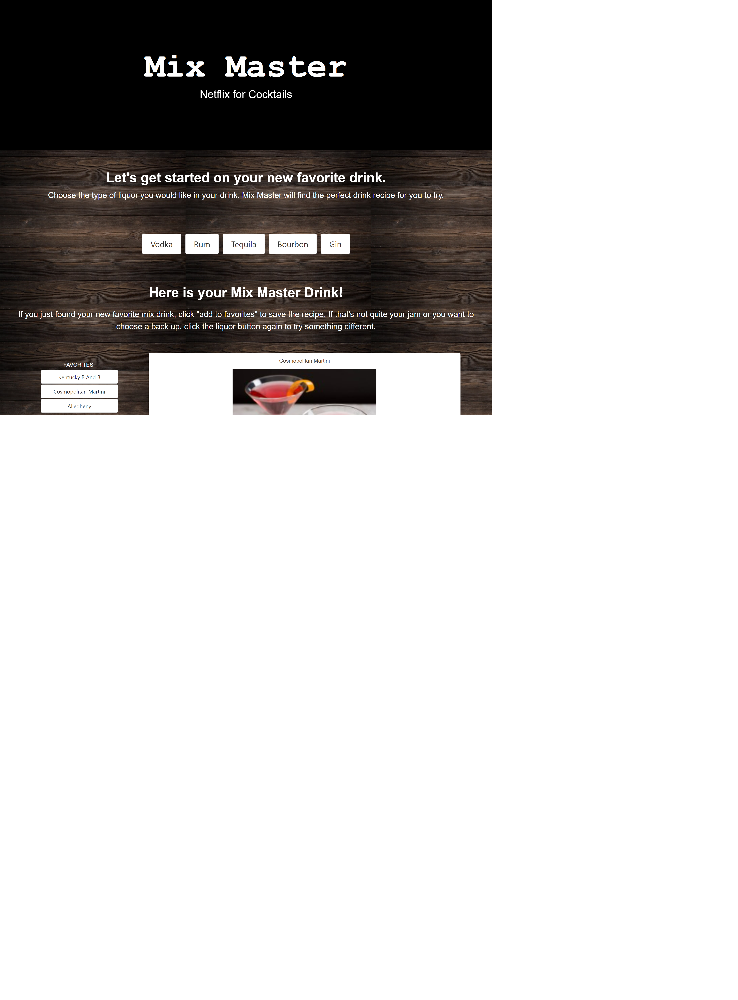

# mix-master

## Description
- Collaborated by Kelly Hunter, Benson Muchemi, and Jordan Turcott
- Mix-Master is a web application to help a user find a cocktail based of their choice of liqour.  The user clicks one of the types of liqour buttons and a fetch call to the CocktailDB api produces an id for that type of liqour.  Using that id another fetch call to CocktailDB api and a math.random function produces a random cocktail for the user.  Using that data an image of the cocktail along with recipe information is displayed on the page.
The user if they are missing any ingredients can then click on a button representing that ingredient to find out store aisle location and average cost.  This is done by doing a fetch call to the Spoonacular api based off ingredient name to find an id.  Another fetch call is made to Spoonacular with that id to produce the aisle and cost info.
If the user wants to store that cocktail as a favorite they can click the drink name button and it will be stored in the 'Favorites' column.

## Languages Used
- Javascript
- JQuery
- Bulma
- HTML
- CSS

## Deployed Page Link
- https://j2021t.github.io/mix-master/

## Deployed Page Screenshot

